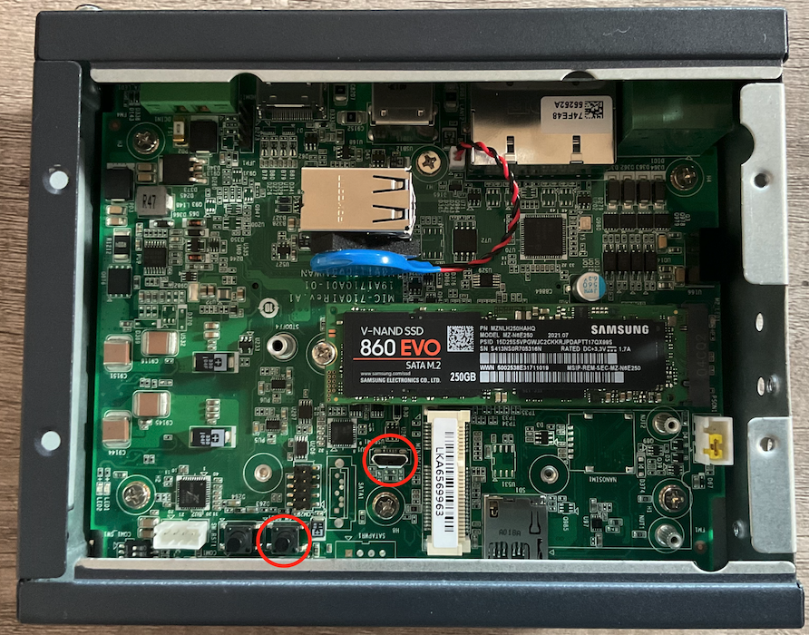

# MVI Edge 8.4 Installation on NVIDIA Jetson Xavier NX

 

## Setting Up the Host VM

### Obtaining VMWare Fusion 12 Pro (OPTIONAL)
> NOTE: This step is only required if you DO NOT have access to VMWare Fusion.
  1. Send an email to atwreqs@us.ibm.com with the following information to request access to VMWare Fusion 12 Pro. 
    a. Job Role (ex. Solutions Engineer) 
    b. Request Reason (ex. MVI Edge Client Demo Install)  
    c. Lotus Notes ID (ex. John Doe/Location/IBM) 
    d. Operating System (ex. MacOS) 
  2. Within 3 days you'll receive an email containing a license key and a link to download VMWare Fusion 12 Pro. Download the software and upon configuration you'll be prompted to enter you license key. 

### Creating an Ubuntu 18.04 VM
  1. Download the Ubuntu 18.04.6 LTS (Bionic Beaver) Desktop Image ISO from the following site (https://releases.ubuntu.com/18.04/).
  2. Launch VMWare Fusion and in the top right corner hit the Plus Sign and select New. From there you'll be asked to select the Installation Method. Drag and drop the recently downloaded ISO to where it says 'Install From Disc or Image'. The ISO should now appear under the Create New Virtual Machine window. Hit Continue.
  3. Provide a Display Name, Account Name, and Password. Choose anything you'd like, but it's recommended to keep it simple (ex. ubuntu). Hit Continue and Finish. Save the VM as 'ubuntu-18.04.6' in the Virtual Machines folder and hit Save. Your VM should start building immediately and once finished, go ahead and login.     

### Using GParted to Increase Disk Space
  1. Download the GParted 1.3.1 AMD64 ISO from the following site (https://gparted.org/download.php) to your PC.
  2. Open up the Terminal on the VM and type `df -h` to get the name of the Filesystem Root. It should appear as `/dev/sda(x)`. 
  3. Shut Down the VM. On VMWare Fusion under the list of Virtual Machines hold CTRL + Right Click on the VM to display the 'Show Config File in Finder' option. Select it to be brought to the VM's .vmx file. Open up the .vmx file with TextEdit and add `biosbootDelay="5000"` to the top of the file then hit Save.
  4. Back on VMWare Fusion, Right Click the VM and go to Settings. Select CD/DVD (SATA) and from the dropdown you'll want to Choose Disc or Image and grab the GParted ISO. Once you've done that, go back to Settings and select Hard Disk (SCSI). Drag the slider to increase the Disk Size to ~ 75GB and hit Apply. You can now close out of the Settings. 
  5. Start the VM and while booting, click inside the VM while repeatedly pressing F2 to be brought to the BIOS. Tab over to the Boot page using the Arrow keys and go down to where it lists CD-ROM Drive. Hit the (+) key to move it to the top of the list. Once you've done that, tab over to Exit and then go down to Save Changes and hit Enter twice. Finally, press F10 and Enter to boot.
  6. GParted should immediately launch. Hit Enter to go with the Default Settings, then press Enter 3 more times to continue with the defaults. You will now be brought to a page where you can view your /dev/sda1 partition. 
  7. Select the /dev/sda1 partition and then click the Resize/Move option. Increase the New Size from ~ 20GB to ~ 65GB and then hit Resize/Move. To apply the changes, hit the green Apply Check Mark and Apply. To exit, click GParted in the top left corner then select Quit. 
  8. Restart the Virtual Machine and upon restarting, click inside the VM while repeatedly pressing F2 to be brought back to the BIOS. Tab over to the Boot page using the Arrow keys and go down to where it lists Hard Drive. Hit the (+) key to move it to the top of the list. Once you've done that, tab over to the Exit and then go down to Save Changes and hit Enter twice. Finally, press F10 and Enter to boot.
  9. Open up the Terminal and type `df -h` to validate that /dev/sda1 was increased. The output should look like `/dev/sda1   63G   5.8G    54G   10%   /`. 

 

## Flashing the Jetson Xavier NX

### Preparing and Executing the Disk Flash
  1. On the VM, download the following .zip file (https://ibm.box.com/v/ssd-disk-mount). Once the download is complete, Right Click the .zip and Extract this to the Desktop location. This should expose the MIC-710AIX_NX_4.6_V0.2_DiskFlash.tbz2 file.
  2. Open up the casing surrounding the Jetson Xavier NX to expose the Micro USB and REC Button (as shown below).   
   
  3. Use the following sequence to put the Jetson NX into Recovery Mode: 
    a. Unplug the Jetson NX Power Cable 
    b. Connect your PC to the Micro USB Port 
    c. Hold the REC Button while plugging in the Power Cable 
    d. Continue to hold the REC Button for 5s 
    e. Release the REC Button 
  4. Your PC should then ask whether you'd like to Connect to PC or Connect to Linux. Select Connect to Linux. To confirm that the Jetson NX is connected, open up the Terminal on the VM and type `lsusb`. The output should show something similar to this `Bus Device 003 ID: 0955:7e19 NVidia Corp.`.
  5. In the Terminal, type `cd Desktop` and `sudo tar xvpf MIC-710AIX_NX_4.6_V0.2_DiskFlash.tbz2` to extract the BSP. Once you've done that, type `cd MIC-710AIX_NX_4.6_V0.2` and `sudo ./nvmflash.sh`. This should begin the flash process which takes about 15 to 20 mins. It should look as follows `Start flashing device: 1-2, PID: XXXX   Ongoing processes: XXXX`.
  6. During the boot process, you'll notice a prompt asking you to Select a Storage to Boot or Install OS. Enter `2` which is the dev/sda. Let the boot process continue until you're brought to the home screen.
  7. Validate that the /dev/sda (which represents the attached SATA SDD) is mounted as the Filesystem Root by typing `df -h` into the Terminal on the Jetson NX. You should see something like this `/dev/sda1  229G  14G 204G  7%  /`.

 

## Installing the MVI Edge Pre-Requisites

### Installing the CUDA Toolkit via NVIDIA's SDK Manager
  1. On the Ubuntu VM, go to (https://developer.nvidia.com/nvidia-sdk-manager) and download the NVIDIA SDK Manager 1.7.2 Ubuntu .deb.
  > NOTE: This requires a NVIDIA Developer Program Membership. This is free so go ahead and make an account.
  2. Once complete, open up the Terminal on the VM and type `sdkmanager` to launch the SDK. Ignore the Warning prompt and click Yes to proceed. You may be asked to log in using the credentials from the previous step.
  3. Reconnect your PC to the Jetson NX via the Micro USB Port. When prompted, select Connect to Linux. The SDK should automatically detect the Jetson NX and auto-populate the STEP 01 DEVELOPMENT ENVIRONMENT with the Product Category as Jetson, the Hardware Configuration as Jetson Xavier NX. Make sure that the Target OS is set to Linux JetPack 4.6 and that the Additional SDKs remains unselected. Hit Continue to STEP O2.
  4. On STEP 02, unselect the Jetson OS and Additional SDKs box. Make sure that the Jetson SDK Components box is checked, as well as Accept the Terms and Conditions at the bottom of the page. Hit Continue to STEP 03 where you'll be prompted to enter your VM Password (ex. `ubuntu`)
  5. On STEP 03, the IP Address of the Jetson NX should be automatically populated. Enter the Jetson NX Username and Password `mic-710aix` then hit Install. The installation process can take up to 30 mins.
  6. When the install is complete, open up the Terminal on the Jetson NX and type `dpkg -l | grep cuda` to validate that the CUDA Toolkit v10.2 was installed.

### Validate Docker Install and NVIDIA Containers
  1. Validate that docker is installed by typing `docker -v` into the Terminal on the Jetson NX. 

### Creating a Root Install Directory
  1. Open up the Terminal on the Jetson NX and type `sudo mkdir /opt/ibm` and then `sudo /opt/ibm/vision-edge`. Navigate to that follow to validate that the directory was created by typing `cd /opt/ibm` and `ls` to see the `vision-edge`.

 

## Installing the MVI Edge Application

### Pull Container Images From IBM Container Registry
  1. Login to the IBM Container Registry (https://myibm.ibm.com/products-services/containerlibrary) and Copy Entitlement Key. Open up the Terminal on the Jetson NX and type `sudo docker login cp.icr.io --username cp --password <entitlement key>` where `<entitlement key>` must be replaced with what you just copied. Once you've run that command you should see `Login Succeeded`.
  2. Go to the Root Install Directory by typing `cd /opt/ibm/vision-edge`. Type the following command to pull the container images: `sudo docker run --rm -v 'pwd':/opt/ibm/vision-edge -e hostname='hostname -f' --privileged - u root cp.icr.io/cp/visualinspection/vision-edge-inception:8.4.0`. 

### Build the MVI Edge Application
  1. In the Terminal on the Jetson NX while still in the /opt/ibm/vision-edge directory, run the following command: `sudo ./startedge.sh`. A License Agreement will then be displayed. Hit Enter until you've reached the end and type `YES`. The application will now start to build. This could take up to 10 mins.
  2. Once finished, the Terminal will present a Username, Password, and URL. IMPORTANT: Be sure to save the Password as it will not be shown again. Take the URL and use it in the Chromium Browser to launch MVI Edge!!
